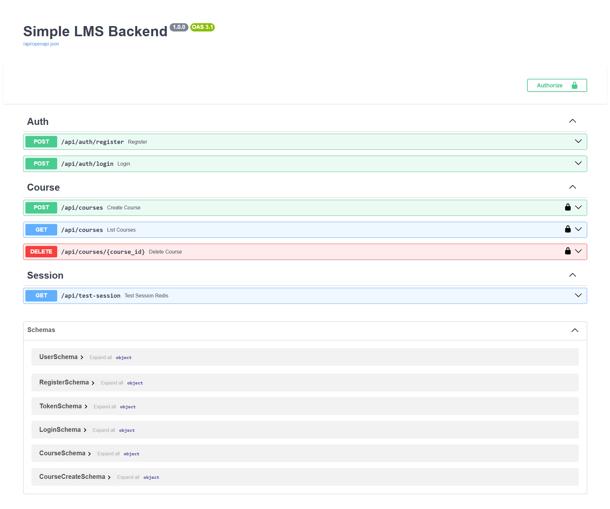
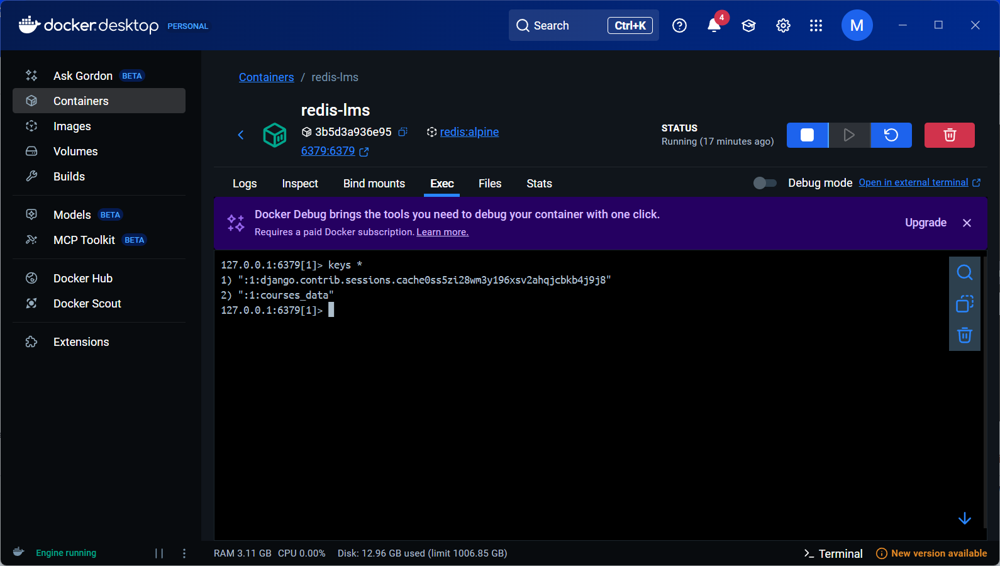

# Simple LMS Backend (Django Ninja + Redis)

Proyek ini adalah Backend untuk **Simple Learning Management System (LMS)** yang dikembangkan sebagai Tugas Akhir Mata Kuliah **Pemrograman Sisi Server**.

Sistem ini dibangun menggunakan **Django** dan **Django Ninja** untuk arsitektur REST API modern, serta mengimplementasikan **Redis** untuk _caching_ dan _session management_.

---

## 📋 Fitur Utama

Proyek ini memenuhi seluruh kriteria fungsional yang diminta:

1.  **Authentication & Security**:
    - Register & Login menggunakan **JWT (JSON Web Token)**.
    - Password hashing (Bcrypt).
    - Rate limiting sederhana pada endpoint login.
2.  **Authorization (RBAC)**:
    - **Admin/Dosen (Role 0/1)**: Memiliki akses penuh (CRUD Course).
    - **Mahasiswa (Role 2)**: Hanya memiliki akses baca (GET Course). Akses tulis/hapus diblokir (403 Forbidden).
3.  **Course Management**:
    - CRUD (Create, Read, Update, Delete) untuk entitas Course.
4.  **High Performance (Redis Integration)**:
    - **Caching**: Menyimpan data `GET /courses` di Redis untuk mempercepat response. Cache otomatis dihapus (_invalidated_) saat ada data baru (POST/DELETE).
    - **Session Storage**: Memindahkan penyimpanan Session Backend dari database SQL ke Redis (Database Index 1).

---

## 🛠 Teknologi

- **Bahasa**: Python 3.10+
- **Framework Web**: Django 4.x
- **API Framework**: Django Ninja (FastAPI-like)
- **Database**: SQLite (Development Default)
- **Cache & NoSQL**: Redis (via Docker)
- **Containerization**: Docker (untuk Redis)

## 🚀 Panduan Instalasi (Setup)

Ikuti langkah-langkah berikut untuk menjalankan proyek di komputer lokal:

### 1. Clone Repository

```bash
git clone https://github.com/Jiwaru/pss-uas-lms-backend.git
cd pss-uas-lms-backend

```

### 2. Setup Virtual Environment

Disarankan menggunakan virtual environment agar dependencies terisolasi.

**Windows:**

```bash
python -m venv venv
venv\Scripts\activate

```

**Mac/Linux:**

```bash
python3 -m venv venv
source venv/bin/activate

```

### 3. Install Dependencies

Pastikan file `requirements.txt` tersedia.

```bash
pip install -r requirements.txt

```

### 4. Menjalankan Redis (Wajib)

Proyek ini **memerlukan Redis** agar fitur Cache dan Session berjalan. Gunakan Docker untuk menjalankannya:

```bash
docker run -d --name redis-lms -p 6379:6379 redis:alpine

```

_Pastikan aplikasi Docker Desktop sudah berjalan sebelum mengetik perintah di atas._

### 5. Migrasi Database

Siapkan database SQLite dan tabel-tabel yang dibutuhkan.

```bash
python manage.py migrate

```

---

## ▶️ Cara Menjalankan Project

Setelah setup selesai, jalankan server Django dengan perintah:

```bash
python manage.py runserver

```

Server akan berjalan di: `http://127.0.0.1:8000`

---

## 🧪 Panduan Testing (Skenario Pengujian)

Pengujian API dapat dilakukan dengan mudah melalui **Swagger UI** yang disediakan otomatis.

1. **Buka Dokumentasi API:**
   Akses URL: [http://127.0.0.1:8000/api/docs](http://127.0.0.1:8000/api/docs)
2. **Langkah 1: Registrasi User (Wajib)**
   Gunakan endpoint `POST /api/auth/register` untuk membuat akun Dosen dan Mahasiswa.

- **Buat Akun Dosen (Role 1):**

```json
{
  "username": "dosen1",
  "password": "password123",
  "role": 1,
  "email": "dosen1@test.com"
}
```

- **Buat Akun Mahasiswa (Role 2):**

```json
{
  "username": "mhs1",
  "password": "password123",
  "role": 2,
  "email": "mhs1@test.com"
}
```

3. **Langkah 2: Login & Authorize**

- Gunakan endpoint `POST /api/auth/login`.
- Masukkan data login (misal: `dosen1` / `password123`).
- Salin **access_token** dari response.
- Klik tombol **Authorize** (Gembok) di kanan atas -> Masukkan: `Bearer <token_kamu>`.

4. **Langkah 3: Create Course (Test RBAC Dosen)**

- Login sebagai **Dosen**.
- Gunakan endpoint `POST /api/courses`.
- Masukkan data:

```json
{
  "title": "Keamanan Siber",
  "description": "Dasar Authentication & Authorization"
}
```

- **Hasil:** Harus `200 OK`.

5. **Langkah 4: Test Security (Mahasiswa)**

- Ganti Token menjadi **Mahasiswa** (Login ulang -> Authorize baru).
- Coba hapus course di endpoint `DELETE /api/courses/{id}`.
- **Hasil:** Harus `403 Forbidden` (Sesuai Soal).

6. **Langkah 5: Test Redis Session**

- Akses endpoint `GET /api/lms/test-session`.
- Refresh browser beberapa kali.
- **Hasil:** Angka `visit_count` bertambah (menandakan session tersimpan di Redis).

---

## 📸 Bukti Implementasi

Berikut adalah bukti bahwa sistem berjalan sesuai spesifikasi soal.

### 1. Tampilan Swagger UI

Seluruh endpoint telah terdokumentasi dan dikelompokkan berdasarkan Tags (Auth, Course, Session).


### 2. Bukti Redis (Cache & Session Aktif)

Tangkapan layar terminal di bawah menunjukkan bahwa data **Session** dan **Cache** benar-benar tersimpan di Redis (Database Index 1).

**Perintah Cek:**

```bash
docker exec -it redis-lms redis-cli
select 1
keys *

```

**Hasil:**


_Penjelasan:_

- Key `:1:courses_data`: Menunjukkan caching aktif untuk endpoint Course.
- Key `django.contrib.sessions...`: Menunjukkan session backend tersimpan di Redis.

---

## 📂 Struktur Project

Struktur folder disusun mengikuti standar starter project UAS:

```text
uas-backend-lms/
├── manage.py
├── requirements.txt
├── README.md
├── simple_lms/           # Project Configuration
│   ├── settings.py       # Konfigurasi Redis & Apps ada di sini
│   └── urls.py
└── lms/                  # Main Application
    ├── utils/
    │   └── rate_limit.py # Fitur Rate Limiting
    ├── api.py            # API Endpoints & Logic
    ├── models.py         # Database Models (User, Course)
    ├── schemas.py        # Pydantic Schemas
    ├── jwt_auth.py       # JWT Authentication Handler
    └── rbac.py           # Role-Based Access Control Logic

```
